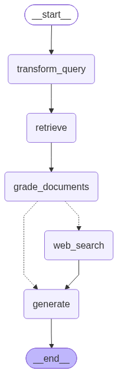

# CRAG — Corrective Retrieval-Augmented Generation

A self-correcting RAG pipeline built with **LangGraph**. Instead of blindly trusting whatever the vector store returns, CRAG *grades* each retrieved document for relevance and falls back to a live **web search** when local knowledge is insufficient — then generates an answer grounded in whichever source(s) actually apply.

**Tech Stack:** Python · LangChain · LangGraph · FAISS · Groq (Llama 3.3 70B) · Tavily · HuggingFace embeddings

---

## Why CRAG exists

Vanilla RAG has a well-known failure mode: it retrieves the top-*k* nearest chunks and feeds them to the LLM regardless of whether they're actually relevant. If the knowledge base doesn't contain the answer, the model either hallucinates or confidently answers from irrelevant context.

CRAG adds a **corrective loop**. After retrieval, an LLM grader judges each document. Three outcomes are possible:

- **All documents relevant** → answer directly from local knowledge.
- **No documents relevant** → discard them and answer from a fresh web search.
- **Some relevant, some not** (the ambiguous case) → keep the good local docs *and* pull in web results, then generate from both.

The result is a pipeline that knows when it doesn't know, and repairs its own context before generating.

---

## Architecture / Flow

```
START → transform_query → retrieve → grade_documents → ┬─(all relevant)──────────────→ generate → END
                                                       │
                                                       └─(any irrelevant)→ web_search → generate → END
```



*The diagram above is generated automatically from the compiled LangGraph (see [Graph visualization](#graph-visualization)).*

**Node by node:**

1. **`transform_query`** — Rewrites the raw user question into a cleaner, self-contained, search-optimized query before anything is retrieved. This improves recall for conversational or messy inputs.
2. **`retrieve`** — Similarity search over the FAISS index (top-*k* = 3).
3. **`grade_documents`** — An LLM grader assigns a binary `yes`/`no` relevance score to each retrieved chunk. Relevant docs are kept; if *any* doc is graded irrelevant, the web-search flag is raised. Sets the initial `source`.
4. **`decide_to_generate`** — Conditional router: `web_search` if the flag is set, otherwise straight to `generate`.
5. **`web_search`** — Tavily web search; results are wrapped as `Document`s and merged with any surviving local docs. Updates `source` to `web` or `local + web`.
6. **`generate`** — Answers the question using **only** the assembled context (local docs + web results), refusing to answer if the context is insufficient.

---

## Key design decisions

**LLM-based grading instead of a similarity threshold.** A cosine-similarity cutoff is brittle — it rewards keyword/topic overlap even when a chunk doesn't actually answer the question. The grader prompt explicitly instructs the model to judge whether the document *helps answer the specific question*, not whether it merely shares a topic. This catches the "relevant-looking but useless" chunks that a threshold would let through.

**Grade → decide → web-search/generate conditional flow.** Correction is modeled as an explicit branch in the graph rather than buried in imperative code. `decide_to_generate` is a pure routing function, which keeps the control flow visible, testable, and easy to visualize.

**Query transformation up front.** Retrieval quality is bounded by query quality. Rewriting the question before retrieval (rather than after a failed attempt) means the very first retrieval pass is already search-optimized, reducing how often the corrective web-search branch is needed.

**Two-source generation (ambiguous handling).** When the knowledge base is *partially* relevant, throwing away the good local chunks would waste real signal. CRAG preserves relevant local documents and augments them with web results, so `generate` sees the union of both. The `source` field records which of `local` / `web` / `local + web` produced the answer.

**Lazy vector-store loading.** The FAISS index is loaded on first use via a module-level singleton, so importing the nodes doesn't pay the load cost until a query actually runs.

---

## Project structure

```
CRAG/
├── src/
│   ├── config.py        # Paths / settings in one place
│   ├── state.py         # GraphState: question, documents, web_results, generation, web_search, source
│   ├── loader.py        # Document loading
│   ├── chunker.py       # Text splitting
│   ├── vector_store.py  # FAISS + HuggingFace embeddings (build/save/load)
│   ├── nodes.py         # transform_query, retrieve, grade_documents, web_search, generate, decide_to_generate
│   └── graph.py         # StateGraph assembly, compiled as `app`
├── main.py              # CLI entry point + graph.png generation
├── graph.png            # Auto-generated flow diagram
├── README.md
└── .env                 # GROQ_API_KEY, TAVILY_API_KEY
```

---

## Setup

**1. Install dependencies**

```bash
pip install langchain langchain-community langchain-core langgraph \
            langchain-groq langchain-huggingface \
            faiss-cpu tavily-python python-dotenv sentence-transformers
```

**2. Configure API keys**

Create a `.env` file in the repo root:

```env
GROQ_API_KEY=your_groq_api_key
TAVILY_API_KEY=your_tavily_api_key
```

- **Groq** — powers the LLM used for query rewriting, document grading, and generation. Get a key at <https://console.groq.com>.
- **Tavily** — powers the corrective web-search fallback. Get a key at <https://tavily.com>.

**3. Add your source data**

Place the document you want to index at the path defined in `src/config.py` (default: `data/data.pdf`). The FAISS index is built automatically on first run and cached to `faiss_index/`.

---

## Usage

```bash
python main.py
```

On first run the vector store is built and saved; subsequent runs load it from disk. You'll then get an interactive prompt:

```
Enter your query (or type 'exit'): What is corrective RAG?

Question: What is corrective RAG?
Answer: ...
Source: local
```

The `Source` line tells you where the answer came from — `local`, `web`, or `local + web`.

### Graph visualization

`main.py` renders the compiled graph to `graph.png` on startup using `app.get_graph().draw_mermaid_png()`. If the drawing dependencies aren't installed, it logs a helpful message and continues without failing. To regenerate manually you can call `save_graph_png()` from `main.py`.

---

## What's next

- **Iterative correction loop** — re-run retrieval with a further-refined query when web search also comes back weak, instead of a single fallback pass.
- **Answer grading / hallucination check** — grade the *generated* answer against its context and regenerate if it isn't grounded.
- **Configurable grading strictness** — expose the relevance threshold and top-*k* as config values.
- **Streaming + citations** — stream tokens and attach per-claim source attribution (local chunk vs. web URL).
- **Evaluation harness** — a small benchmark set to measure how often the corrective branch fires and whether it improves answer quality.
